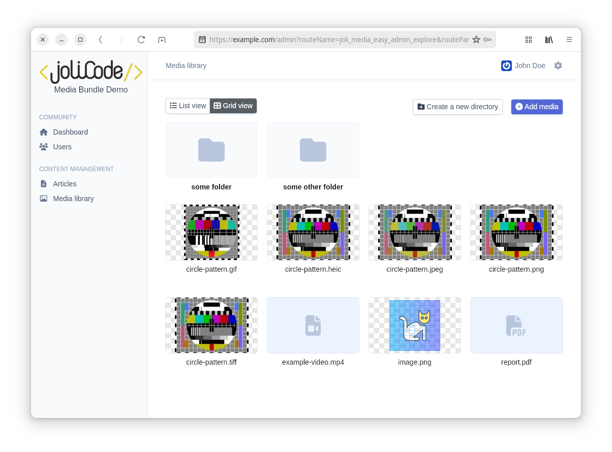

<h1 align="center">
  <a href="https://github.com/jolicode/MediaBundle"></a>
  <br />
  JoliMediaBundle – Media management for Symfony
  <br />
  <sub><em><h6>Upload, store, manage, transform, compress and display all in one tool.</h6></em></sub>
</h1>

This bundle provides a tools to manage media in Symfony applications and embed a full-featured media library in your admin.

- [EasyAdmin](https://symfony.com/bundles/EasyAdminBundle/current/index.html) and [SonataAdmin](https://symfony.com/bundles/SonataAdminBundle/current/index.html) integrations
- abstract media storage
- processors to transform media (crop / resize / etc.)
- post processors to optimize the media size
- Twig components to output `` and `<picture>` tags
- CLI commands to generate and inspect media variations that are high quality yet lightweight
- the ability to generate URLs for media and their variations
- events to allow you to hook into the media processing pipeline
- an integration with Doctrine entities, so you can easily manage media in your entities
- debug toolbar and profiler panel to monitor media processing in your application



## Installation

JoliMediaBundle requires Symfony 7+. It can be installed via Composer:

```
composer require jolicode/media-bundle
```

## Documentation

Read the detailed [documentation of the bundle](https://mediabundle.jolicode.com/).

## License

This software is published under the [MIT License](LICENSE.md).

<div align="center">
<a href="https://jolicode.com/"></a>
</div>
