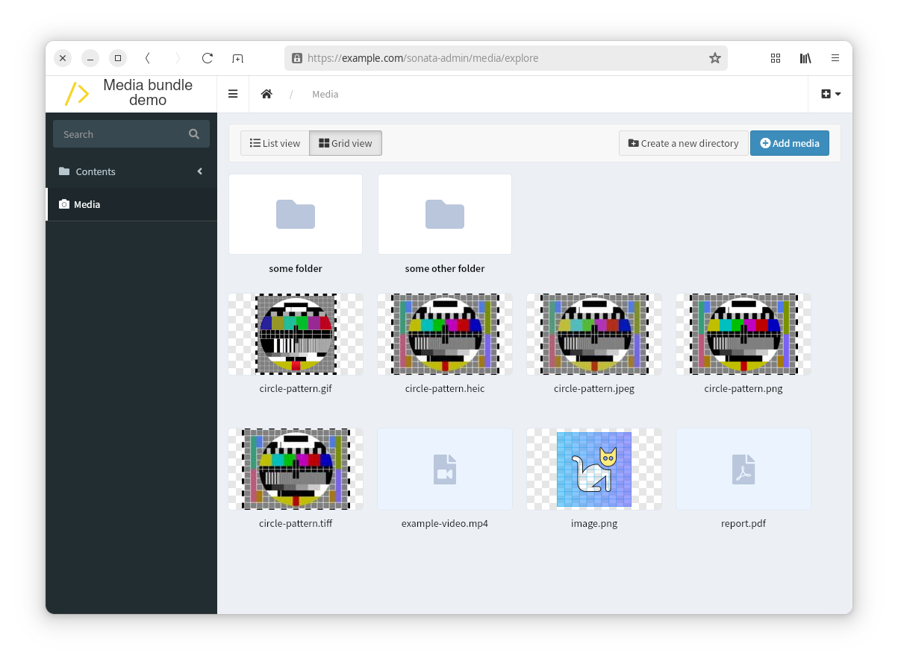
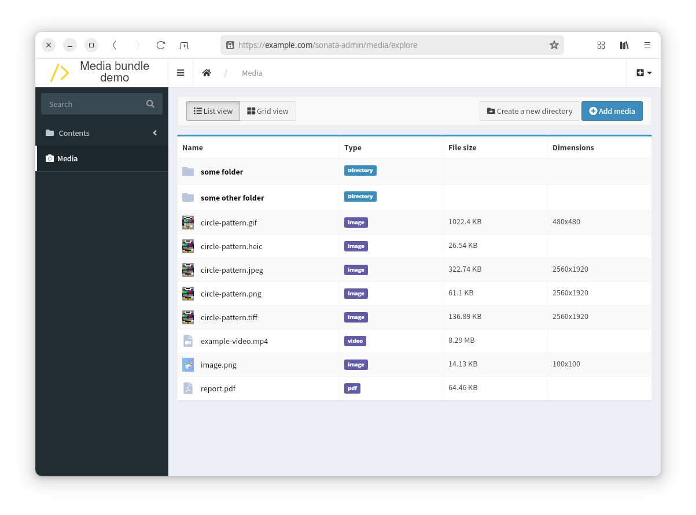

Sonata Admin Integration
========================

The ``JoliMediaBundle`` provides seamless integration with Sonata Admin, enabling you to manage media directly within your Sonata Admin interface. This integration includes features such as a media library, media browser, and media preview capabilities.

Enabling the Sonata Admin Integration
-------------------------------------

To enable the integration, you need to register the ``JoliMediaSonataAdminBundle`` in your Symfony application. Add the following line to your ``bundles.php`` file::

    // filepath: config/bundles.php
    return [
        // ...
        JoliCode\MediaBundle\Bridge\SonataAdmin\JoliMediaSonataAdminBundle::class => ['all' => true],
    ];

Additionally, define the routes for the media library in your routing configuration:

.. code-block:: yaml

    # filepath: config/routes/joli_media.yaml
    _joli_media_sonata_admin:
        resource: "@JoliMediaSonataAdminBundle/src/Controller/"
        prefix: /admin/media

Configuring the Sonata Admin Integration
----------------------------------------

The integration can be configured in the ``config/packages/joli_media_sonata_admin.yaml`` file. Below is an example configuration:

.. code-block:: yaml

    joli_media_sonata_admin:
        visibility:
            show_variations_stored: true
            show_variations_action_regenerate: true
            show_html_code: true
            show_markdown_code: true

Configuration Options
~~~~~~~~~~~~~~~~~~~~~

The ``upload`` section of the configuration allows you to control the media upload behavior in Sonata admin:

- ``max_files``: Sets the maximum number of files that can be uploaded at once.
- ``max_file_size``: Sets the maximum file size for uploads (in megabytes).
- ``accepted_files``: Specifies the MIME types of files that can be uploaded. You can use wildcards like `image/*` or specific types like `application/pdf`.

The ``visibility`` section of the configuration allows you to control the visibility of various features in the Sonata admin media interface:

- ``show_variations_stored``: Enables the display of whether media variations are stored.
- ``show_variations_action_regenerate``: Enables the "Regenerate Variations" action for media.
- ``show_html_code``: Displays the HTML code for embedding media.
- ``show_markdown_code``: Displays the Markdown code for embedding media.

Media selector widget
---------------------

A media selector widget is available for Sonata Admin. You can use it in your admin classes to allow users to select media items easily from the media library::

    use JoliCode\MediaBundle\Bridge\SonataAdmin\Form\Type\MediaChoiceType;
    use Sonata\AdminBundle\Form\FormMapper;

    class ArticleAdmin extends AbstractAdmin
    {
        protected function configureFormFields(FormMapper $formMapper)
        {
            $formMapper

                // ...

                ->add('media', MediaChoiceType::class, [
                    'required' => false,
                ])
            ;
        }
    }

The ``MediaChoiceType`` field will render a media selector widget in the form, allowing users to select media items from the media library. A preview of the selected media will be displayed, along with options to upload new media or select existing ones.

This optional ``folder`` parameter can be passed to the field type, to specify which folder should be opened by default in the media browser. Note that, if a media was already selected, the media selector will open the folder of the selected media::

    class ArticleAdmin extends AbstractAdmin
    {
        protected function configureFormFields(FormMapper $formMapper)
        {
            $formMapper
                ->add('media', MediaChoiceType::class, [
                    'required' => false,
                    'folder' => 'my-folder',
                ])
            ;
        }
    }

The ``MediaChoiceType`` can be nested into a ``CollectionType``, allowing you to manage multiple media items in a single form. This is particularly useful for managing collections of images or other media types::

    class ArticleAdmin extends AbstractAdmin
    {
        protected function configureFormFields(FormMapper $formMapper)
        {
            $formMapper
                ->add('images', CollectionType::class, [
                    'by_reference' => false,
                    'help' => 'Add some images to illustrate this article',
                ], [
                    'edit' => 'inline',
                    'inline' => 'table',
                ])
            ;
        }
    }

Restricting access to the Media library controller
--------------------------------------------------

The Media library controller in the bundle uses Symfony's security voters to control access to its actions. By default, all users are allowed to perform all actions on the media library (provided they can access the admin interface, of course). However, you might want to restrict access to certain actions based on your application's requirements, the user identity or roles, etc. For this purpose, you can create your own security voter - just make sure to add the ``joli_media_admin.security.voter`` alias to your voter service so that it overrides the default voter provided by the bundle.

You can implement your own Voter from scratch or extend the ``JoliCode\MediaBundle\Bridge\Security\Voter\MediaVoter`` class and override its methods to implement your custom access logic::

    namespace App\Security\Voter;

    use JoliCode\MediaBundle\Bridge\Security\Voter\MediaVoter as BaseMediaVoter;
    use Symfony\Component\DependencyInjection\Attribute\AsAlias;
    use Symfony\Component\Security\Core\User\UserInterface;

    #[AsAlias(id: 'joli_media_admin.security.voter')]
    class MediaVoter extends BaseMediaVoter
    {
        protected function canDelete(?UserInterface $user, string $libraryName, string $path): bool
        {
            if ('john.doe@example.com' === $user?->getUserIdentifier()) {
                // John Doe can delete any media
                return true;
            }

            if ('public-storage' === $libraryName) {
                // only users with the ROLE_ADMIN role can delete media in the public-storage library
                return \in_array('ROLE_ADMIN', $user?->getRoles() ?? [], true);
            }

            // other users cannot delete media in the private folder
            return !str_starts_with($path, 'private/');
        }
    }

The ``JoliCode\MediaBundle\Bridge\Security\Voter\MediaVoter`` class provides several methods that you can override to customize access control for different actions, such as ``canList``, ``canUpload``, ``canDelete``, etc. You can implement your own logic based on the user, library name, path, or any other criteria relevant to your application:

- ``canList``: Determine if the user can list media in a specific library and path
- ``canShow``: Determine if the user can view a specific media item
- ``canCreateDirectory``: Determine if the user can create a directory in a specific parent folder
- ``canUpload``: Determine if the user can upload media to a specific path
- ``canDelete``: Determine if the user can delete a specific media item
- ``canDeleteDirectory``: Determine if the user can delete a specific directory
- ``canMove``: Determine if the user can move a media item from one path to another
- ``canRenameDirectory``: Determine if the user can rename a specific directory
- ``canRegenerateVariation``: Determine if the user can regenerate a specific variation of a media item
