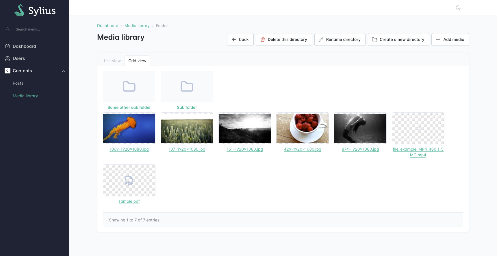
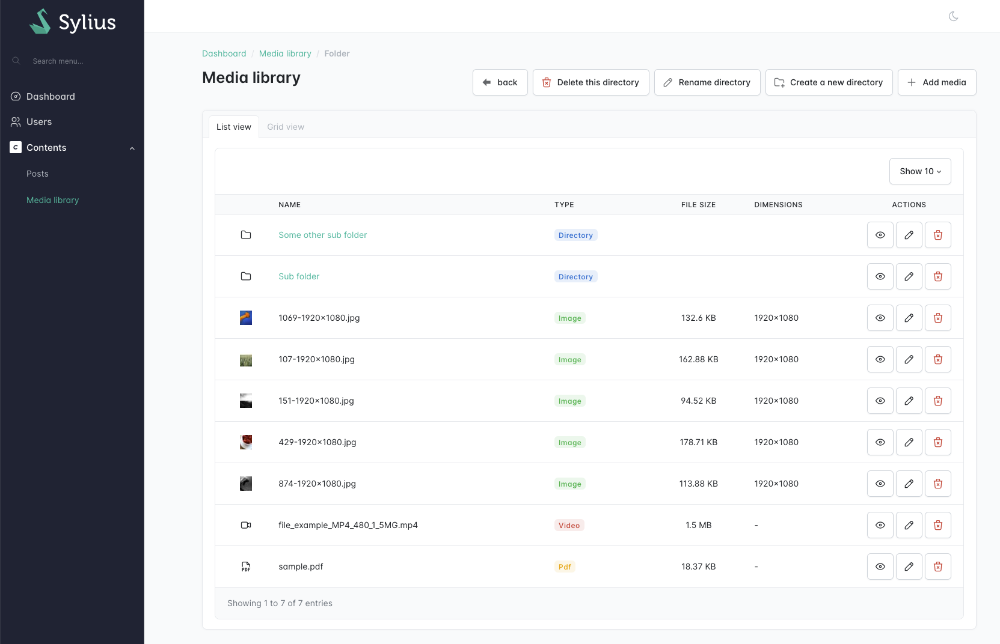

Sylius Integration
==================

The ``JoliMediaBundle`` provides seamless integration with `Sylius <https://sylius.com>`_ and `Sylius Stack <https://stack.sylius.com/>`_, enabling you to manage media directly within your Sylius interface. This integration includes features such as a media library, media browser, and media preview capabilities.

Enabling the Sylius Integration
-------------------------------

To enable the integration, you need to register the ``JoliMediaSyliusBundle`` in your Symfony application. Add the following line to your ``bundles.php`` file::

    // filepath: config/bundles.php
    return [
        // ...
        JoliCode\MediaBundle\Bridge\Sylius\JoliMediaSyliusBundle::class => ['all' => true],
    ];

Additionally, define the routes for the media library in your routing configuration:

.. code-block:: yaml

    # filepath: config/routes/joli_media.yaml
    _joli_media_sylius:
        resource: "@JoliMediaSyliusBundle/src/Admin/Controller/"
        prefix: /admin/media

Then, import the bundle configuration in the ``config/packages/joli_media_sylius.yaml`` file.

.. code-block:: yaml

    # filepath: config/packages/joli_media_sylius.yaml
    imports:
        - { resource: '@JoliMediaSyliusBundle/config/app.php' }

Configuring the Sylius Integration
----------------------------------

The integration can be configured in the ``config/packages/joli_media_sylius.yaml`` file. Below is an example configuration:

.. code-block:: yaml

    # filepath: config/packages/joli_media_sylius.yaml
    imports:
        - { resource: '@JoliMediaSyliusBundle/config/app.php' }

    joli_media_easy:
        pagination:
            per_page: [10, 25, 50]
        upload:
            max_files: 10
            max_file_size: 20
            accepted_files:
                - image/*
                - video/*
                - application/pdf
        visibility:
            show_variations_list: true
            show_variations_list_admin_variations: true
            show_variations_stored: true
            show_variations_action_regenerate: true
            show_html_code: true
            show_markdown_code: true

Configuration Options
~~~~~~~~~~~~~~~~~~~~~

The ``pagination`` section controls how media items are loaded and displayed:

- ``per_page``: Number of media items to display per page (default: ``[10, 25, 50]``). This improves performance for large libraries by loading only a subset of items.

The ``upload`` section of the configuration allows you to control the media upload behavior in EasyAdmin:

- ``max_files``: Sets the maximum number of files that can be uploaded at once.
- ``max_file_size``: Sets the maximum file size for uploads (in megabytes).
- ``accepted_files``: Specifies the MIME types of files that can be uploaded. You can use wildcards like ``image/*`` or specific types like ``application/pdf``.

The ``visibility`` section of the configuration allows you to control the visibility of various features in the EasyAdmin media interface:

- ``show_variations_list``: Shows the list of variations in a dedicated tab on the media show page.
- ``show_variations_list_admin_variations``: Shows the variations defined in by the admin bridge in the variations list tab.
- ``show_variations_stored``: Enables the display of whether media variations are stored.
- ``show_variations_action_regenerate``: Enables the "Regenerate Variations" action for media.
- ``show_html_code``: Displays the HTML code for embedding media.
- ``show_markdown_code``: Displays the Markdown code for embedding media.

Pagination and Performance
~~~~~~~~~~~~~~~~~~~~~~~~~~

For large media libraries (hundreds or thousands of files), pagination significantly improves performance by loading only a subset of items at a time. The media library uses traditional page navigation with Previous/Next buttons, which is ideal for precise navigation in very large libraries.

You can configure the number of items displayed per page:

.. code-block:: yaml

    joli_media_easy_admin:
        pagination:
            per_page: [10, 25, 50]

Media library menu item
-----------------------

To add a link to the media library in your Sylius Admin menu, you need to add the ``joli_media_sylius_admin_explore`` route

On Sylius:
~~~~~~~~~~

::

    namespace App\Menu\Admin;

    use Sylius\Bundle\UiBundle\Menu\Event\MenuBuilderEvent;
    use Symfony\Component\EventDispatcher\Attribute\AsEventListener;

    #[AsEventListener(event: 'sylius.menu.admin.main']
    final class AdminMenuListener
    {
        public function __invoke(MenuBuilderEvent $event): void
        {
            $menu = $event->getMenu();

            $this->addContentsSubMenu($menu);
        }

        private function addContentsSubMenu(ItemInterface $menu): void
        {
            $library = $menu
                ->addChild('contents')
                ->setLabel('Contents')
                ->setLabelAttribute('icon', 'simple-icons:craftcms')
                ->setExtra('always_open', true)
            ;

            $library->addChild('media_library', ['route' => 'joli_media_sylius_admin_explore'])
                ->setLabel('media_library')
                ->setExtra('translation_domain', 'JoliMediaSyliusBundle')
            ;
        }
    }

On Sylius stack:
~~~~~~~~~~~~~~~~

::

    namespace App\Menu\Admin;

    use Sylius\AdminUi\Knp\Menu\MenuBuilderInterface;
    use Symfony\Component\DependencyInjection\Attribute\AsDecorator;

    #[AsDecorator(decorates: 'sylius_admin_ui.knp.menu_builder')]
    final readonly class MenuBuilder implements MenuBuilderInterface
    {
        public function __construct(
            private MenuBuilderInterface $decorated,
        ) {
        }

        public function createMenu(array $options): ItemInterface
        {
            $menu = $this->decorated->createMenu($options);

            $this->addContentsSubMenu($menu);

            return $menu;
        }

        private function addContentsSubMenu(ItemInterface $menu): void
        {
            $library = $menu
                ->addChild('contents')
                ->setLabel('Contents')
                ->setLabelAttribute('icon', 'simple-icons:craftcms')
                ->setExtra('always_open', true)
            ;

            $library->addChild('media_library', ['route' => 'joli_media_sylius_admin_explore'])
                ->setLabel('media_library')
                ->setExtra('translation_domain', 'JoliMediaSyliusBundle')
            ;
        }
    }

From the media library, you will be able to upload new files and switch between a grid or a list view to browse them. You can also organize your media by creating sub-folders, and perform CRUD operations.

Media selector widget
---------------------

A media selector widget is available for Sylius. You can use it in your admin classes to allow users to select media items easily from the media library.

::

    namespace App\Form;

    use App\Entity\User;
    use JoliCode\MediaBundle\Bridge\Sylius\Admin\Form\Type\MediaChoiceType;
    use Symfony\Component\Form\AbstractType;
    use Symfony\Component\Form\FormBuilderInterface;
    use Symfony\Component\OptionsResolver\OptionsResolver;

    class UserType extends AbstractType
    {
        public function buildForm(FormBuilderInterface $builder, array $options): void
        {
            $builder
                // ...
                ->add('profilePicture', MediaChoiceType::class)
            ;
        }

        public function configureOptions(OptionsResolver $resolver): void
        {
            $resolver->setDefaults([
                'data_class' => User::class,
            ]);
        }
    }

The ``MediaChoiceType`` field will render a media selector widget in the form, allowing users to select media items from the media library. A preview of the selected media will be displayed, along with options to upload new media or select existing ones.

This optional ``folder`` parameter can be passed to the field type, to specify which folder should be opened by default in the media browser. Note that, if a media was already selected, the media selector will open the folder of the selected media::

::

    $builder
        // ...
        ->add('profilePicture', MediaChoiceType::class, [
            'folder' => 'users',
        ])
    ;
