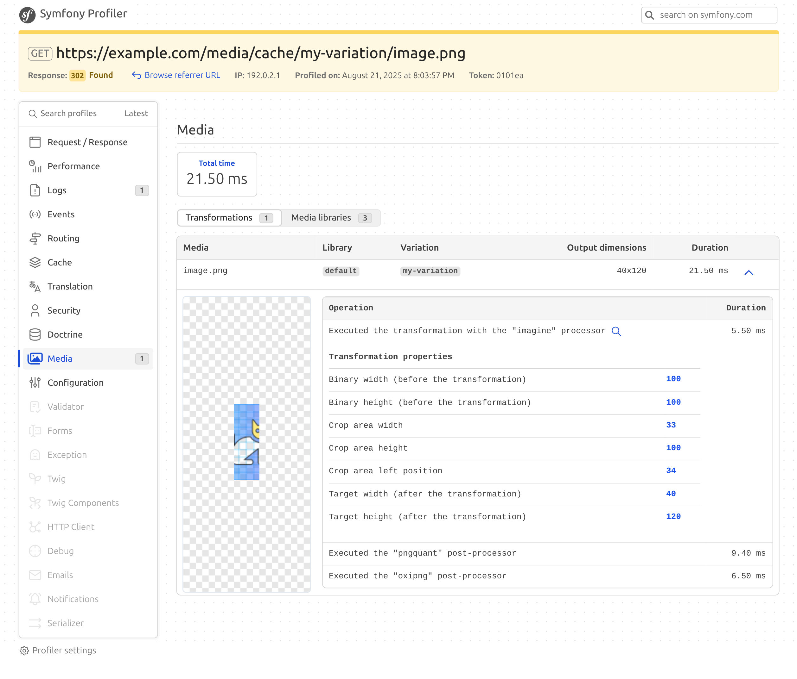
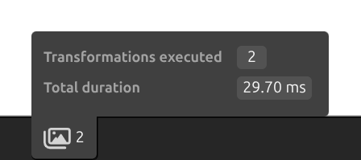

Debug tooling
=============

The MediaBundle includes a `Web Profiler panel <https://symfony.com/doc/current/profiler.html>`_ and a Web Developer Toolbar block, to help diagnose the media processing performed during a request.

The MediaBundle profiler panel provides information about the configured libraries and the transformations performed during the request. For each `variation <../variations/variations.rst>`_ that has been computed, it displays the total computing time and information about each of the steps of the transformation pipeline (pre-processors, processors, post-processors).

The Web Developer Toolbar block displays a summary of the media processing performed during the request, including the number of variations generated and the time spent processing media:

