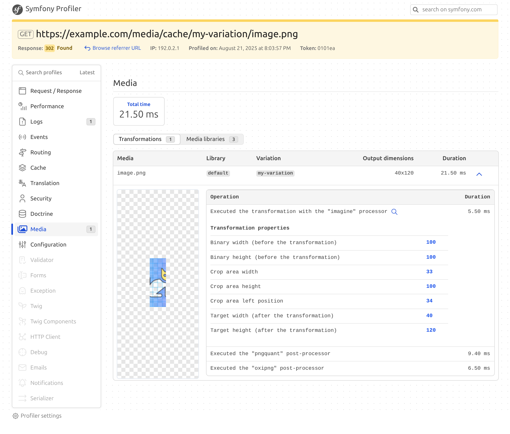
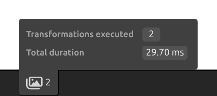

Debug tooling
=============

The MediaBundle includes a `Web Profiler panel <https://symfony.com/doc/current/profiler.html>`_ and a Web Developer Toolbar block, to help diagnose the media processing performed during a request.

The MediaBundle profiler panel provides information about the configured libraries and the transformations performed during the request. For each `variation <../variations/variations.rst>`_ that has been computed, it displays the total computing time and information about each of the steps of the transformation pipeline (pre-processors, processors, post-processors).

The panel also has a "Processors" tab, which lists the pre-processors, processors and post-processors, tells why some of them are not registered, and flags the binaries that cannot be executed. It warns when the ``imagine`` processor is not registered, in which case the variations can only be generated in the WebP and GIF formats. In both situations, the "Media" entry of the profiler menu, the "Processors" tab and the Web Developer Toolbar block are highlighted as a warning, so the problem can be noticed without opening the panel. The same information is available on the command line, with the ``joli:media:debug:processors`` `command <commands.rst>`_.

The Web Developer Toolbar block displays a summary of the media processing performed during the request, including the number of variations generated and the time spent processing media. It is displayed when the request processed some media, or when the processing chain has a problem:

